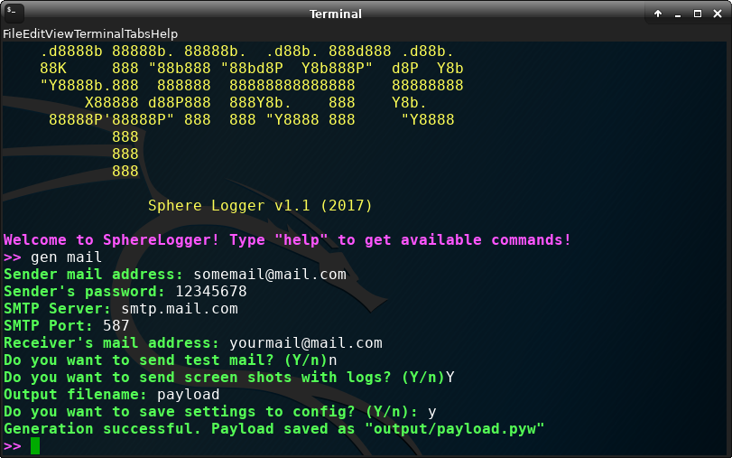

# SphereLogger
## Install
```bash
git clone https://github.com/Emberium/SphereLogger.git SphereLogger
cd SphereLogger
pip3 install -r requirements.txt
```
## Using
```bash
python3 sphere.py
```
Type help to get available commands
## Feathures
* Send logs each 10 minutes
* Screenshosts
* Autorun
* TCP Connection for real-time keylogger
...And more!
## If your terminal does not support colors
Edit config.ini parametrs
```
[GENERAL]
colored = 0
```
## Screenshots



